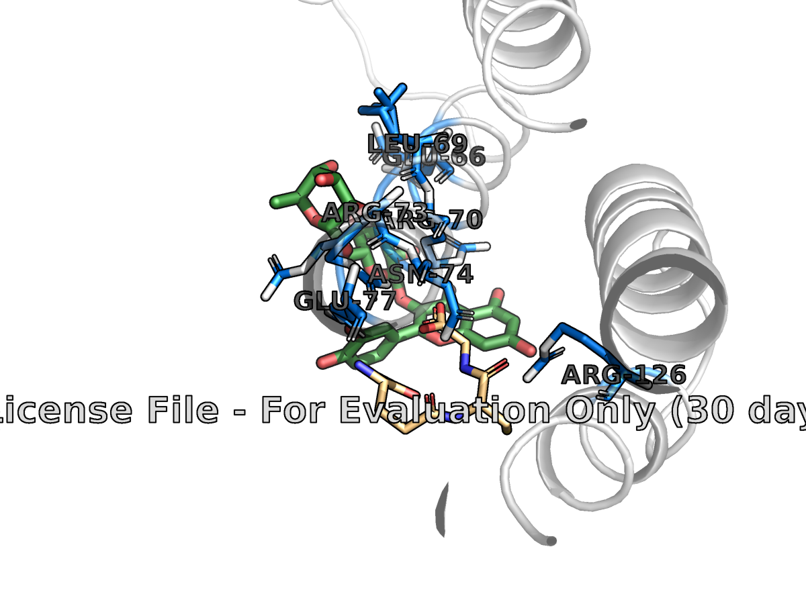

# In Silico Pharmacological Modelling: Rutin vs. mPGES-1

## Project Overview
This project performs in silico molecular docking to investigate the interaction between Rutin, a bioactive 
flavonoid, and mPGES-1 (microsomal Prostaglandin E Synthase-1). This research builds upon the phytochemical 
identification work of Prof. Sofidiya's group, aimed at understanding the competitive inhibitory potential of 
Rutin against the mPGES-1 enzyme to block inflammatory $PGE_2$ biosynthesis.

## Objective
To physically model the bioactive 3D conformations of **Rutin** (a prominent flavonoid identified in Prof. Sofidiya’s 
research) and evaluate its spatial, electrostatic, and structural compatibility within the active site binding pocket 
of human **mPGES-1** (using structural biology data from the Protein Data Bank- PDB: **4AL0**).

## Methodology
The project pipeline follows a four-stage computational workflow:
1. Ligand Preparation: Conformational search and energy minimization using RDKit (MMFF94 force field).
2. Receptor Cleaning: Structural isolation, dehydration, and active-site centroid calculation using Biopython.
3. Molecular Docking: Grid-based binding simulation with AutoDock Vina (32-thread Monte Carlo search).
4. Analysis & Visualization: Biophysical interaction mapping and ray-traced 3D rendering using PyMOL.

## Tech Stack
- Python (3.10+)
- RDKit, Biopython, Meeko
- AutoDock Vina
- PyMOL (Molecular Visualization)

## Key Results
The docking simulation successfully identified the binding mode of Rutin within the mPGES-1 interfacial cleft.

| Parameter                          | Result                                           |
|------------------------------------|--------------------------------------------------|
| Best Binding Affinity ($\Delta G$) | -7.4 kcal/mol                                    |
| Key Residues Targeted              | Glu66, Leu69, Arg70, Arg73, Asn74, Glu77, Arg126 |
| Dominant Interaction Type          | Hydrogen Bonding & Electrostatic Interactions    |

## Visual


*Figure: 3D Visualization showing Rutin (green) docked in the mPGES-1 pocket, interacting with key residues (Arg70, Arg126).*

## Project Structure
```bash
rutin3d/
├── .gitignore
├── LICENSE
├── README.md
├── data/
│   ├── processed/
│   │   ├── docking/
│   │   │   ├── receptor_prepared.pdbqt
│   │   │   ├── rutin_docked_poses.pdbqt
│   │   │   └── rutin_prepared.pdbqt
│   │   ├── generate_complex/
│   │   │   ├── RUTIN_MPGES1_COMPLEX_PROTEIN_GSH_A_1153.png
│   │   │   ├── RUTIN_MPGES1_COMPLEX_PROTEIN_GSH_A_1153.pse
│   │   │   ├── report.txt
│   │   │   └── report.xml
│   │   ├── ligand_prep/
│   │   │   └── best_rutin.sdf
│   │   └── receptor_prep/
│   │       └── receptor_clean.pdb
│   └── raw/
│       └── 4AL0.pdb
├── main.py
├── requirements.txt
├── results/
│   ├── rutin_docking_final.png
│   ├── rutin_mpges1_complex.pdb
│   ├── style_complex.pml
│   └── vina_docking.log
├── scripts/
│   ├── __pycache__/
│   │   ├── ligand_prep.cpython-312.pyc
│   │   └── receptor_prep.cpython-312.pyc
│   ├── docking.py
│   ├── generate_complex.py
│   ├── ligand_prep.py
│   └── receptor_prep.py
└── vina.exe
```

## How to Run
1. Ensure all dependencies are installed
```commandline
pip install rdkit-pypi biopython meeko vina
```
2. Run the full pipeline from your terminal
```commandline
python main.py
```
3. Once complete, open PyMOL and run the styling script
```text
@results/style_complex.pml
```

## References
- Protein Data Bank (PDB ID: 4AL0)
- Forli Lab, Scripps Research (Meeko API)
- Prof. Sofidiya et al.

_Created by Daniella Ene-Obong, B.Pharm Candidate, University of Lagos_